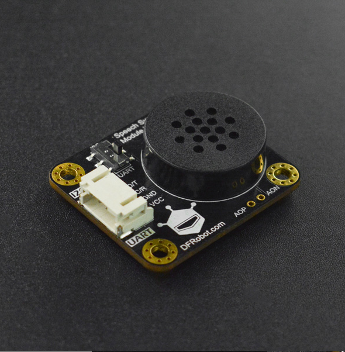

## DFRobot_SpeechSynthesis

让声音为你的项目增添一抹特色！连接上语音合成模块，再添加几行简单的代码就可以让您的项目开口说话。无论是中文还是英文对于语音合成模块来说都是so easy，播报当前时间，播报环境数据统统不在话下，与语音识别模块结合还可实现语音对话！该模块采用I2C和UART两种通讯方式，Gravity接口，兼容绝大部分主控。模块上已经自带了一个喇叭，所以您无需再额外的添加喇叭.




## 产品链接（https://www.dfrobot.com.cn/goods-3014.html）
    DFR0760：中英文语音合成模块
	
## 目录

* [概述](#概述)
* [库安装](#库安装)
* [方法](#方法)
* [兼容性](#兼容性y)
* [历史](#历史)
* [创作者](#创作者)

## 概述

   1.合成语音<br>


## 库安装

This Sensor should work with DFRobot_SpeechSynthesis on RaspberryPi. <br>
Run the program:

```python 
 python Speech_Synthesis.py
```

## 方法

```python

  def speak(self ,string):
    '''
      @brief 合成语音
      @param string  要合成的内容，可以是中文，英文，数字等
    '''

  def set_voice(self, voc):
    '''
      @brief 设置语音的音量大小
      @param voc  音量数值(0-9)
    '''
  def set_speed(self, speed):
    '''
      @brief 设置语音的播放速度
      @param speed 速度数值(0-9)
    '''
  def set_sound_type(self, type):
    '''
      @brief 设置声音种类
      @param type (MALE:男,FEMALE:女,DONALDDUCK:唐老鸭)
    '''
  def set_tone(self, tone):
    '''
      @brief 设置音调
      @param tone 音调数值(0-9)
    '''
  def set_english_pron(self, pron): 
    '''
      @brief 设置英文发音
      @param pron (ALPHABET:以字母单个发音,WORD:以单词发音)
    '''
```

## 兼容性


| 主板         | 通过 | 未通过 | 未测试 | 备注 |
| ------------ | :--: | :----: | :----: | :--: |
| RaspberryPi2 |      |        |   √    |      |
| RaspberryPi3 |      |        |   √    |      |
| RaspberryPi4 |  √   |        |        |      |

* Python 版本

| Python  | 通过 | 未通过 | 未测试 | 备注 |
| ------- | :--: | :----: | :----: | ---- |
| Python2 |  √   |        |        |      |
| Python3 |  √   |        |        |      |

## History

- 2021/08/12 - 1.0.0 版本


## Credits

Written by fengli(li.feng@dfrobot.com), 2020.11.6 (Welcome to our [website](https://www.dfrobot.com/))
